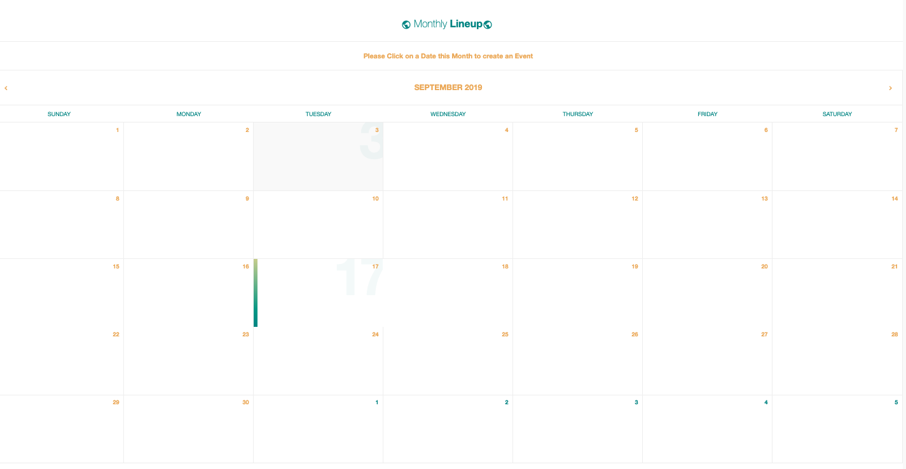

# Welcome to Monthly Lineup!

## What is Monthly Lineup?
 Monthly Lineup was created as a personal calendar app. Users can signup/login and create "events" by clicking on a date and populating the form at the bottom of the page.

## Configuration
- Clone the repository to your computer
- Navigate to the parent folder, `back-end-calendar-app`
- Run `bundle install`
- Run `rails s` in your server to start your local server
- Open `http://localhost:3000/` in your browser
- Next, navigate over to `front-end-calendar-app`
- Run `bundle install` followed by `npm start` and agree to running on another port

